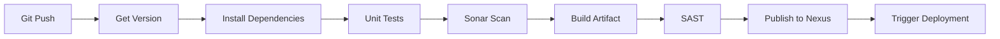
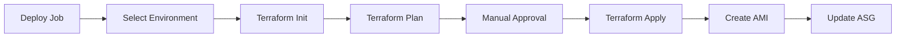

# 🚀 RoboShop - Multi-Environment Infrastructure & CI/CD Pipeline

> **Enterprise-grade DevOps implementation for RoboShop e-commerce platform**  
> A comprehensive infrastructure-as-code solution with automated CI/CD pipelines for DEV and PROD environments

[](https://www.terraform.io/)
[](https://aws.amazon.com/)
[](https://www.jenkins.io/)
[](https://www.ansible.com/)

---

## 📋 Table of Contents

- [Overview](#-overview)
- [Architecture](#-architecture)
- [Project Structure](#-project-structure)
- [Infrastructure Components](#-infrastructure-components)
- [CI/CD Pipeline](#-cicd-pipeline)
- [Prerequisites](#-prerequisites)
- [Deployment Guide](#-deployment-guide)
- [Environment Management](#-environment-management)
- [Security](#-security)
- [Monitoring & Logging](#-monitoring--logging)
- [Troubleshooting](#-troubleshooting)

---

## 🎯 Overview

This repository contains the complete DevOps implementation for the RoboShop microservices application, featuring:

- **Multi-environment infrastructure** (DEV/PROD) using Terraform
- **Automated CI/CD pipelines** with Jenkins
- **Configuration management** with Ansible
- **AWS cloud-native architecture** with VPC, ALB, Auto Scaling
- **Security best practices** with IAM roles and Security Groups
- **Infrastructure state management** with S3 backend and DynamoDB locking

### Key Features

✅ **Infrastructure as Code** - Complete AWS infrastructure provisioned via Terraform  
✅ **Blue-Green Deployments** - Zero-downtime deployments with Auto Scaling Groups  
✅ **Multi-Environment Support** - Isolated DEV and PROD environments  
✅ **Automated Configuration** - Ansible-based application deployment  
✅ **CI/CD Pipeline** - Jenkins-based build and deployment automation  
✅ **Security Hardened** - VPN access, security groups, and IAM roles  

---

## 🏗️ Architecture

### High-Level Architecture

```
┌─────────────────────────────────────────────────────────────────┐
│                         Internet Gateway                         │
└─────────────────────┬───────────────────────────────────────────┘
                      │
         ┌────────────▼──────────────┐
         │   Web ALB (Public)        │
         │   *.stallions.space       │
         └────────────┬──────────────┘
                      │
         ┌────────────▼──────────────┐
         │   Web Servers             │
         │   (Auto Scaling Group)    │
         └────────────┬──────────────┘
                      │
         ┌────────────▼──────────────┐
         │   App ALB (Private)       │
         │   *.app-dev/prod          │
         └────────────┬──────────────┘
                      │
    ┌─────────────────┼─────────────────┐
    │                 │                 │
┌───▼────┐      ┌────▼─────┐     ┌────▼─────┐
│Catalogue│      │   User   │     │   Cart   │
│  ASG    │      │   ASG    │     │   ASG    │
└───┬────┘      └────┬─────┘     └────┬─────┘
    │                │                 │
    └────────────────┼─────────────────┘
                     │
         ┌───────────▼──────────────┐
         │  Database Subnet         │
         │  MongoDB, MySQL, Redis   │
         └──────────────────────────┘
```

### Network Architecture

- **VPC CIDR**: 10.0.0.0/16 (DEV), 10.1.0.0/16 (PROD)
- **Public Subnets**: 2 AZs for high availability
- **Private Subnets**: Application tier
- **Database Subnets**: Isolated database tier
- **VPC Peering**: Connection to default VPC for management

---

## 📁 Project Structure

```
.
├── 01-roboshop-Infra-DEV/          # Development Environment
│   ├── 01-vpc/                     # VPC, Subnets, Route Tables
│   ├── 02-firewall/                # Security Groups
│   ├── 03-vpn/                     # VPN Instance
│   ├── 04-mongodb/                 # MongoDB Instance
│   ├── 05-app-alb/                 # Application Load Balancer
│   └── 06-IAM/                     # IAM Roles & Policies
│
├── 02-roboshop-Infra-PROD/         # Production Environment
│   ├── 01-vpc/
│   ├── 02-firewall/
│   ├── 03-vpn/
│   ├── 04-mongodb/
│   ├── 05-app-alb/
│   └── 06-IAM/
│
├── 03-continuous-integration/      # CI Pipeline
│   ├── Jenkinsfile                 # Build pipeline
│   ├── package.json                # Application metadata
│   └── server.js                   # Application code
│
└── 04-continuous-deployment/       # CD Pipeline
    ├── Jenkinsfile                 # Deployment pipeline
    └── terraform/                  # Deployment automation
        ├── catalogue.sh            # Bootstrap script
        ├── main.tf                 # ASG, Launch Template, ALB
        ├── data.tf                 # Data sources
        └── variables.tf            # Variables
```

---

## 🔧 Infrastructure Components

### 1. **VPC (Virtual Private Cloud)**
- **CIDR Blocks**: Isolated network ranges per environment
- **Subnets**: Multi-AZ deployment for high availability
- **Route Tables**: Public, private, and database routing
- **Internet Gateway**: Internet connectivity for public subnets
- **NAT Gateway**: Outbound internet for private subnets
- **VPC Peering**: Management access from default VPC

### 2. **Security Groups**
Comprehensive firewall rules for:
- VPN access (SSH from home IP)
- MongoDB (Port 27017)
- Redis (Port 6379)
- MySQL (Port 3306)
- RabbitMQ (Port 5672)
- Application ALB (Port 80)
- Web ALB (Ports 80, 443)
- Component-to-component communication

### 3. **Compute Resources**
- **EC2 Instances**: AlmaLinux 8.10
- **Auto Scaling Groups**: Dynamic scaling based on CPU
- **Launch Templates**: Standardized instance configuration
- **AMI Creation**: Golden images for fast deployment

### 4. **Load Balancing**
- **Application ALB**: Internal load balancer for microservices
- **Web ALB**: Internet-facing load balancer
- **Target Groups**: Health check monitoring
- **Listener Rules**: Host-based routing

### 5. **Database Layer**
- **MongoDB**: Product catalog and user data
- **MySQL**: Shipping service database
- **Redis**: Session storage and caching
- **RabbitMQ**: Message queue for async processing

### 6. **DNS & Routing**
- **Route53**: Domain management (stallions.space)
- **Records**: 
  - `mongodb-dev.stallions.space`
  - `*.app-dev.stallions.space`
  - `catalogue.app-dev.stallions.space`

### 7. **IAM & Security**
- **Instance Profiles**: EC2 role attachment
- **SSM Managed Instance Core**: Systems Manager access
- **Service Roles**: Secure AWS API access

### 8. **State Management**
- **S3 Backend**: Remote state storage
- **DynamoDB**: State locking
- **SSM Parameter Store**: Configuration management

---

## 🔄 CI/CD Pipeline

### Continuous Integration (Build Pipeline)



**Pipeline Stages:**

1. **Get Version**: Extract version from `package.json`
2. **Install Dependencies**: `npm install`
3. **Unit Tests**: Run test suites
4. **Sonar Scan**: Code quality analysis
5. **Build**: Create deployment artifact (zip)
6. **SAST**: Static application security testing
7. **Publish**: Upload to Nexus repository
8. **Deploy**: Trigger downstream deployment job

### Continuous Deployment (Deploy Pipeline)



**Pipeline Stages:**

1. **Environment Selection**: Choose DEV/QA/PROD
2. **Terraform Init**: Initialize backend and providers
3. **Terraform Plan**: Preview infrastructure changes
4. **Manual Approval**: Gated deployment
5. **Terraform Apply**: Provision infrastructure
6. **AMI Creation**: Golden image from configured instance
7. **Auto Scaling**: Launch new instances with updated AMI
8. **Health Checks**: Verify deployment success

### Deployment Strategy

- **Blue-Green Deployment**: Zero-downtime updates
- **Rolling Updates**: Gradual instance replacement
- **Health Check Grace Period**: 300 seconds
- **Deregistration Delay**: 60 seconds

---

## 📦 Prerequisites

### Required Tools

| Tool | Version | Purpose |
|------|---------|---------|
| Terraform | ≥ 1.0 | Infrastructure provisioning |
| AWS CLI | ≥ 2.0 | AWS resource management |
| Jenkins | ≥ 2.300 | CI/CD automation |
| Ansible | ≥ 2.9 | Configuration management |
| Git | ≥ 2.30 | Version control |

### AWS Requirements

- **AWS Account** with administrative access
- **EC2 Key Pair** (`EC2-key`) created in ap-south-1
- **S3 Bucket**: `sarthak-remote-tfstate`
- **DynamoDB Table**: `sarthak-tfstate-lock`
- **Route53 Hosted Zone**: `stallions.space`

### Jenkins Setup

Required plugins:
- Pipeline Utility Steps
- Nexus Artifact Uploader
- AWS Credentials Plugin
- Git Plugin
- Workspace Cleanup

### Credentials Configuration

Add to Jenkins credentials:
- `nexus-auth`: Nexus username/password
- `aws-creds`: AWS access key/secret key
- SSH private key: `EC2-key.pem`

---

## 🚀 Deployment Guide

### Step 1: Initialize Infrastructure (One-time Setup)

#### DEV Environment

```bash
# 1. Deploy VPC
cd 01-roboshop-Infra-DEV/01-vpc
terraform init
terraform plan
terraform apply -auto-approve

# 2. Deploy Firewall (Security Groups)
cd ../02-firewall
terraform init
terraform apply -auto-approve

# 3. Deploy VPN
cd ../03-vpn
terraform init
terraform apply -auto-approve

# 4. Deploy MongoDB
cd ../04-mongodb
terraform init
terraform apply -auto-approve

# 5. Deploy Application ALB
cd ../05-app-alb
terraform init
terraform apply -auto-approve

# 6. Deploy IAM Roles
cd ../06-IAM
terraform init
terraform apply -auto-approve
```

#### PROD Environment

```bash
# Repeat the same steps in 02-roboshop-Infra-PROD directory
cd 02-roboshop-Infra-PROD/01-vpc
# ... follow same sequence
```

### Step 2: Configure Jenkins

#### Create CI Pipeline Job

1. **New Item** → `catalogue-ci` → Pipeline
2. Configure Git repository: `https://github.com/[your-repo]/roboshop`
3. Set script path: `03-continuous-integration/Jenkinsfile`
4. Enable **GitHub hook trigger for GITScm polling**

#### Create CD Pipeline Job

1. **New Item** → `catalogue-deploy` → Pipeline
2. **This project is parameterized**:
   - Choice: `environment` (dev, qa, prod)
   - String: `version` (default: 1.0.0)
3. Set script path: `04-continuous-deployment/Jenkinsfile`

### Step 3: Deploy Application

#### Automated Deployment (via CI/CD)

```bash
# Push code to trigger CI pipeline
git add .
git commit -m "Deploy version 3.0.0"
git push origin main

# CI pipeline will:
# 1. Build artifact
# 2. Publish to Nexus
# 3. Trigger CD pipeline

# CD pipeline will prompt for:
# - Environment selection
# - Manual approval
```

#### Manual Deployment (Direct Terraform)

```bash
cd 04-continuous-deployment/terraform

# Deploy to DEV
terraform init
terraform apply \
  -var="env=dev" \
  -var="app_version=3.0.0" \
  -auto-approve

# Deploy to PROD (requires approval workflow)
terraform apply \
  -var="env=prod" \
  -var="app_version=3.0.0" \
  -auto-approve
```

### Step 4: Verify Deployment

```bash
# Check Auto Scaling Group
aws autoscaling describe-auto-scaling-groups \
  --auto-scaling-group-names roboshop-catalogue-dev-*

# Check Target Group health
aws elbv2 describe-target-health \
  --target-group-arn [TARGET_GROUP_ARN]

# Access application
curl http://catalogue.app-dev.stallions.space/health
# Expected: {"app":"OK-2","mongo":true}
```

---

## 🌍 Environment Management

### Environment Variables

Stored in AWS SSM Parameter Store:

```
/roboshop/dev/
├── vpc_id
├── public_subnet_ids
├── private_subnet_ids
├── database_subnet_ids
├── mongodb_sg_id
├── catalogue_sg_id
├── app_alb_sg_id
├── app_alb_listener_arn
└── mongodb_url

/roboshop/prod/
└── [same structure]
```

### Environment-Specific Configuration

| Parameter | DEV | PROD |
|-----------|-----|------|
| VPC CIDR | 10.0.0.0/16 | 10.1.0.0/16 |
| Instance Type | t2.micro | t3.medium |
| Min ASG Size | 1 | 2 |
| Max ASG Size | 3 | 10 |
| Desired Capacity | 1 | 2 |
| Domain | app-dev | app-prod |

### Scaling Configuration

**Auto Scaling Policy:**
- Type: Target Tracking
- Metric: Average CPU Utilization
- Target: 50%
- Cooldown: 300 seconds

**Scaling Events:**
- Scale Out: CPU > 50% for 2 consecutive periods
- Scale In: CPU < 50% for 2 consecutive periods

---

## 🔒 Security

### Network Security

- **VPN Access**: All backend resources accessible only via VPN
- **Security Groups**: Least privilege access
- **Private Subnets**: Application and database tiers isolated
- **No Public IPs**: Only ALB exposed to internet

### Application Security

- **IAM Roles**: No hardcoded credentials
- **SSM Session Manager**: SSH-less instance access
- **Secrets Management**: Stored in SSM Parameter Store
- **SAST Scanning**: Integrated in CI pipeline

### State Security

- **S3 Backend Encryption**: At rest and in transit
- **DynamoDB Locking**: Prevent concurrent modifications
- **Versioning Enabled**: State history maintained

### Best Practices Implemented

✅ No root credentials in code  
✅ Least privilege IAM policies  
✅ Encrypted data stores  
✅ Private subnet isolation  
✅ Security group whitelisting  
✅ VPN-only administrative access  

---

## 📊 Monitoring & Logging

### Health Checks

**Application Load Balancer:**
- Path: `/health`
- Port: 8080
- Interval: 15 seconds
- Healthy Threshold: 2
- Unhealthy Threshold: 3
- Timeout: 5 seconds

**Auto Scaling Group:**
- Type: ELB
- Grace Period: 300 seconds

### CloudWatch Metrics

Monitored metrics:
- CPU Utilization
- Network In/Out
- Disk I/O
- Target Health
- Request Count
- Response Time

### Logging

- **Application Logs**: `/var/log/catalogue/`
- **System Logs**: CloudWatch Logs agent
- **Access Logs**: ALB access logs → S3

---

## 🔍 Troubleshooting

### Common Issues

#### Issue: Terraform State Lock

```bash
# Error: Error acquiring the state lock
# Solution: Release lock manually
aws dynamodb delete-item \
  --table-name sarthak-tfstate-lock \
  --key '{"LockID":{"S":"sarthak-remote-tfstate/vpc-roboshop-dev"}}'
```

#### Issue: ASG Instances Not Healthy

```bash
# Check target group health
aws elbv2 describe-target-health \
  --target-group-arn [ARN]

# Check instance logs
aws ssm start-session --target [INSTANCE-ID]
sudo journalctl -u catalogue -f
```

#### Issue: AMI Creation Timeout

```bash
# Increase timeout in Terraform
lifecycle {
  create_before_destroy = true
  ignore_changes = [image_id]
}
```

#### Issue: DNS Resolution

```bash
# Verify Route53 records
aws route53 list-resource-record-sets \
  --hosted-zone-id [ZONE-ID]

# Test DNS resolution
nslookup catalogue.app-dev.stallions.space
```

### Debug Commands

```bash
# Check Security Group rules
aws ec2 describe-security-groups \
  --group-ids [SG-ID]

# View SSM parameters
aws ssm get-parameters-by-path \
  --path /roboshop/dev \
  --recursive

# Check Auto Scaling activities
aws autoscaling describe-scaling-activities \
  --auto-scaling-group-name [ASG-NAME] \
  --max-records 20
```

---

## 📝 Additional Resources

### Repository Links

- **VPC Module**: [Terraform-AWS-VPC-Advanced](https://github.com/Sarthakx67/Terraform-AWS-VPC-Advanced.git)
- **Security Group Module**: [RoboShop-Security-Group-Module](https://github.com/Sarthakx67/RoboShop-Security-Group-Module.git)
- **Ansible Roles**: [RoboShop-Ansible-Roles-tf](https://github.com/Sarthakx67/RoboShop-Ansible-Roles-tf.git)
- **Jenkins Shared Library**: `roboshop-shared-library`

### Documentation

- [Terraform AWS Provider](https://registry.terraform.io/providers/hashicorp/aws/latest/docs)
- [Jenkins Pipeline Syntax](https://www.jenkins.io/doc/book/pipeline/syntax/)
- [Ansible Documentation](https://docs.ansible.com/)
- [AWS Auto Scaling](https://docs.aws.amazon.com/autoscaling/)

---

## 🤝 Contributing

This is a DevOps-focused repository. Contributions welcome for:

- Infrastructure improvements
- Pipeline optimizations
- Security enhancements
- Documentation updates

### Contribution Workflow

1. Fork the repository
2. Create feature branch: `git checkout -b feature/improvement`
3. Test changes in DEV environment
4. Submit pull request with detailed description

---

## 📄 License

This project is part of a learning exercise. Use at your own discretion.

---

## 👨‍💻 Author

**DevOps Engineer**  
Infrastructure & CI/CD Implementation for RoboShop Platform

---

<div align="center">

**⭐ Star this repo if you find it useful!**

</div>